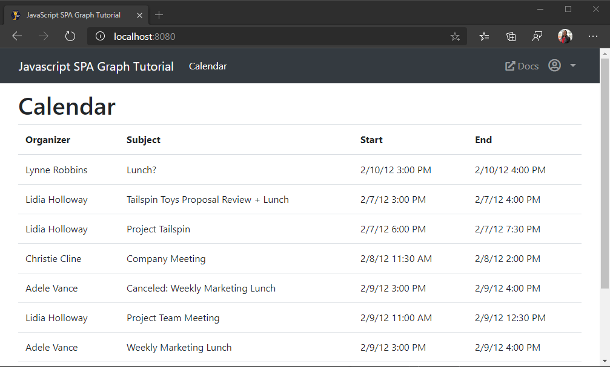

<!-- markdownlint-disable MD002 MD041 -->

<span data-ttu-id="5ba99-101">En este ejercicio, incorporará Microsoft Graph a la aplicación.</span><span class="sxs-lookup"><span data-stu-id="5ba99-101">In this exercise you will incorporate the Microsoft Graph into the application.</span></span> <span data-ttu-id="5ba99-102">Para esta aplicación, usará la biblioteca de la [biblioteca cliente de JavaScript de Microsoft Graph](https://github.com/microsoftgraph/msgraph-sdk-javascript) para realizar llamadas a Microsoft Graph.</span><span class="sxs-lookup"><span data-stu-id="5ba99-102">For this application, you will use the [Microsoft Graph JavaScript Client Library](https://github.com/microsoftgraph/msgraph-sdk-javascript) library to make calls to Microsoft Graph.</span></span>

## <a name="get-calendar-events-from-outlook"></a><span data-ttu-id="5ba99-103">Obtener eventos de calendario de Outlook</span><span class="sxs-lookup"><span data-stu-id="5ba99-103">Get calendar events from Outlook</span></span>

<span data-ttu-id="5ba99-104">En esta sección, usará la biblioteca cliente de Microsoft Graph para obtener eventos de calendario para el usuario.</span><span class="sxs-lookup"><span data-stu-id="5ba99-104">In this section, you'll use the Microsoft Graph client library to get calendar events for the user.</span></span>

1. <span data-ttu-id="5ba99-105">Cree un nuevo archivo en la raíz del proyecto denominado **timezones.js** y agregue el código siguiente.</span><span class="sxs-lookup"><span data-stu-id="5ba99-105">Create a new file in the root of the project named **timezones.js** and add the following code.</span></span>

    :::code language="javascript" source="../demo/graph-tutorial/timezones.js" id="zoneMappingsSnippet":::

    <span data-ttu-id="5ba99-106">Este código asigna los identificadores de zona horaria de Windows a los identificadores de zona horaria de IANA para obtener compatibilidad con moment.js.</span><span class="sxs-lookup"><span data-stu-id="5ba99-106">This code maps Windows time zone identifiers to IANA time zone identifiers for compatibility with moment.js.</span></span>

1. <span data-ttu-id="5ba99-107">Agregue la siguiente función a **graph.js**.</span><span class="sxs-lookup"><span data-stu-id="5ba99-107">Add the following function to **graph.js**.</span></span>

    :::code language="javascript" source="../demo/graph-tutorial/graph.js" id="getEventsSnippet":::

    <span data-ttu-id="5ba99-108">Tenga en cuenta lo que está haciendo este código.</span><span class="sxs-lookup"><span data-stu-id="5ba99-108">Consider what this code is doing.</span></span>

    - <span data-ttu-id="5ba99-109">La dirección URL a la que se llamará es `/me/calendarview` .</span><span class="sxs-lookup"><span data-stu-id="5ba99-109">The URL that will be called is `/me/calendarview`.</span></span>
    - <span data-ttu-id="5ba99-110">El `header` método agrega un `Prefer` encabezado que especifica la zona horaria preferida del usuario.</span><span class="sxs-lookup"><span data-stu-id="5ba99-110">The `header` method adds a `Prefer` header specifying the user's preferred time zone.</span></span>
    - <span data-ttu-id="5ba99-111">El `query` método agrega las horas de inicio y finalización de la vista de calendario.</span><span class="sxs-lookup"><span data-stu-id="5ba99-111">The `query` method adds the start and end times for the calendar view.</span></span>
    - <span data-ttu-id="5ba99-112">El `select` método limita los campos devueltos para cada evento a solo aquellos que la vista usará realmente.</span><span class="sxs-lookup"><span data-stu-id="5ba99-112">The `select` method limits the fields returned for each events to just those the view will actually use.</span></span>
    - <span data-ttu-id="5ba99-113">El `orderby` método ordena los resultados por la hora de inicio, con el primer evento más próximo.</span><span class="sxs-lookup"><span data-stu-id="5ba99-113">The `orderby` method sorts the results by the start time, with the earliest event being first.</span></span>
    - <span data-ttu-id="5ba99-114">El `top` método solicita hasta 50 eventos en la respuesta.</span><span class="sxs-lookup"><span data-stu-id="5ba99-114">The `top` method requests up to 50 events in the response.</span></span>

1. <span data-ttu-id="5ba99-115">Abra **ui.js** y agregue la siguiente función.</span><span class="sxs-lookup"><span data-stu-id="5ba99-115">Open **ui.js** and add the following function.</span></span>

    ```javascript
    function showCalendar(events) {
      // TEMPORARY
      // Render the results as JSON
      var alert = createElement('div', 'alert alert-success');

      var pre = createElement('pre', 'alert-pre border bg-light p-2');
      alert.appendChild(pre);

      var code = createElement('code', 'text-break',
        JSON.stringify(events, null, 2));
      pre.appendChild(code);

      mainContainer.innerHTML = '';
      mainContainer.appendChild(alert);
    }
    ```

1. <span data-ttu-id="5ba99-116">Actualice la `switch` instrucción en la `updatePage` función para llamar `showCalendar` cuando la vista es `Views.calendar` .</span><span class="sxs-lookup"><span data-stu-id="5ba99-116">Update the `switch` statement in the `updatePage` function to call `showCalendar` when the view is `Views.calendar`.</span></span>

    :::code language="javascript" source="../demo/graph-tutorial/ui.js" id="updatePageSnippet" highlight="18-20":::

1. <span data-ttu-id="5ba99-117">Guarde los cambios y actualice la aplicación.</span><span class="sxs-lookup"><span data-stu-id="5ba99-117">Save your changes and refresh the app.</span></span> <span data-ttu-id="5ba99-118">Inicie sesión y haga clic en el vínculo de **calendario** en la barra de navegación.</span><span class="sxs-lookup"><span data-stu-id="5ba99-118">Sign in and click the **Calendar** link in the nav bar.</span></span> <span data-ttu-id="5ba99-119">Si todo funciona, debería ver un volcado JSON de eventos en el calendario del usuario.</span><span class="sxs-lookup"><span data-stu-id="5ba99-119">If everything works, you should see a JSON dump of events on the user's calendar.</span></span>

## <a name="display-the-results"></a><span data-ttu-id="5ba99-120">Mostrar los resultados</span><span class="sxs-lookup"><span data-stu-id="5ba99-120">Display the results</span></span>

<span data-ttu-id="5ba99-121">En esta sección, actualizará la `showCalendar` función para mostrar los eventos de forma más fácil de uso.</span><span class="sxs-lookup"><span data-stu-id="5ba99-121">In this section you will update the `showCalendar` function to display the events in a more user-friendly manner.</span></span>

1. <span data-ttu-id="5ba99-122">Reemplace la función `showCalendar` existente por lo siguiente.</span><span class="sxs-lookup"><span data-stu-id="5ba99-122">Replace the existing `showCalendar` function with the following.</span></span>

    :::code language="javascript" source="../demo/graph-tutorial/ui.js" id="showCalendarSnippet":::

    <span data-ttu-id="5ba99-123">Esto recorre la colección de eventos y agrega una fila de tabla para cada uno.</span><span class="sxs-lookup"><span data-stu-id="5ba99-123">This loops through the collection of events and adds a table row for each one.</span></span>

1. <span data-ttu-id="5ba99-124">Guarde los cambios y actualice la aplicación.</span><span class="sxs-lookup"><span data-stu-id="5ba99-124">Save the changes and refresh the app.</span></span> <span data-ttu-id="5ba99-125">Haga clic en el vínculo del **calendario** y la aplicación ahora debe representar una tabla de eventos para la semana actual.</span><span class="sxs-lookup"><span data-stu-id="5ba99-125">Click on the **Calendar** link and the app should now render a table of events for the current week.</span></span>

    
